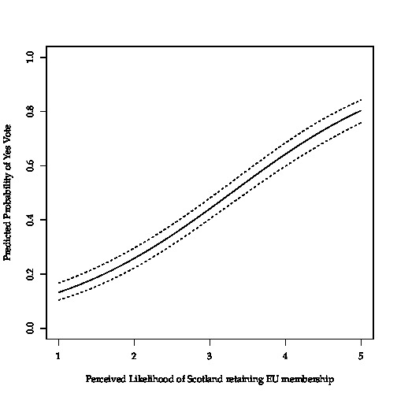
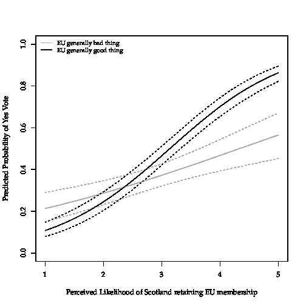

For my Master's thesis, submitted in July 2017, I investigated the voting behaviour of the Scottish electorate in the 2014 Scottish independence referendum. More precisely, I was the first attempting to explain voting behaviour in the referendum based on a multivariate quantitative approach. In doing so, I additionally focused on Scots' attitudes towards the European Union and how these attitudes influence(d) their behaviour at the ballots. Whilst the existing literature on the referendum mostly ignored the European dimension of the independence debate, my results suggest that the Scots did in fact somehow think about the future of Scotland within or outside of the EU when the cast their vote -- and that these attitudes did have an effect on how they would decide. 

*In sum, my results are the following *(ceteris paribus)*: Scots who found EU membership to be a good thing and who thought that an independent Scotland would not be able to remain in the EU had a comparatively low probability of voting in favour of independence. However, once they believed that independent Scotland would be able to remain an EU member, the probability of voting in favour of independence increased sharply. These effects (based on logistic regression controlling for all sorts of variables and attitudes such as age, gender, nationalism, party identificiation, etc.) become more easy to understand once they are presented in a graph using predicted probabilities (higher values of "Perceived Likelihood of Scotland retaining EU membership" mark higher confidence of the survey respondent):*

*This relationship gets even more pronounced after computing an interaction effect and separating between proponents and opponents of EU membership:*

*This blog post was just meant to be as short presentation of my results. [Here](Thesis_Yannik_Buhl.pdf) you can download the PDF with the full thesis.*